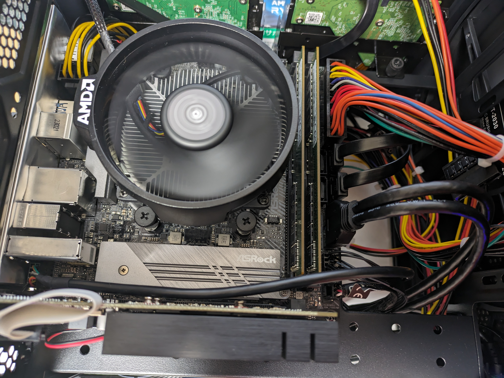

Title: 自宅サーバーと医学科での使用例
Category: プログラミング
Tags: python, docker, ubuntu, server
Summary: 自宅サーバーの構成、セットアップ、運用と個人/医学科で使っているサービスの紹介

# 本記事の対象者

* 自宅サーバーを作りたい人
* 自宅サーバーを運用したい人
* サブスクリプションサービスをself hosted serviceで置換したい人
* botを作りたい人

# 概要

* 自宅サーバー編
  * パーツ選定・組み立て
  * 初期設定
  * dockerのサービスデプロイ
* サービス編
  * Slackbot
  * Discordbot
  * Nextcloud
  * Gitlab
  * Netdata

# 自宅サーバー編

## パーツ選定

早速ですが、下のパーツを選びました。順に説明します。

| 名称              | 型番                         | 値段  |
| ----------------- | ---------------------------- | ----- |
| CPU               | Ryzen 5 3600                 | 10000 |
| GPU               | 玄人志向 GeForce GT-730      | 5800  |
| メモリ            | 家に落ちてた16GB x 2         | 不明  |
| SSD               | 家に落ちてた500GB            | 不明  |
| HDD               | 家に落ちてた6TB(WD Blue) x 2 | 不明  |
| CPUファン         | Noctua NH-L9a                | 7200  |
| ケース            | Thermaltake Core V1          | 7258  |
| ケースファン(2個) | Noctua NF-A8                 | 5300  |
| 電源              | 玄人志向 KRPW-L5-500W        | 5636  |
| マザーボード      | ASRock A520 M-ITX            | 16136 |
| 合計              |                              | 57330 |

CPUは性能が低いが消費電力も低いCeleronが使われますが、私は複数のサービスを運用したいため消費電力が高くなっても性能が比較的良いRyzen 5 3600を選定しました。CPUは故障しにくいので、メルカリで中古を買うことで安く購入しました。参考までにCPUの性能を示すベンチマークの表を下に示します。

| CPU名           | R23 ベンチマーク | 説明                |
| --------------- | ---------------- | ------------------- |
| Intel i9 14900K | 41193            | 現在最強のCPU       |
| Ryzen 9 5950X   | 28641            | 1世代前最強のCPU    |
| Ryzen 5 3600    | 9150             | 今回購入したCPU     |
| Celeron J4125   | 1541             | 2019年発売のCeleron |


GPUは安価なGT-730を選びました。OSのインストールにはGPUが必要なのでGPU内臓のCPUかGPUが必要ですが、私はAI生成などハイエンドGPUを使うタスクをするつもりがなかったので、安さで選びました。ただし、電気代的な意味でファンレスのGT-710にすればよかったと若干後悔しています。

参考：[Ryzenをグラボ無しで動かす](https://jyn.jp/running-ryzen-without-gpu/)


HDDは同じメーカーのものを使用したのですが、RAIDにするのでメーカーを揃えないほうが良かったです。今回採用したRAID1は同時にHDDが壊れるのは1台までという前提条件がありますが、同じメーカーだと同じタイミングで故障する可能性が高くなるからです。


CPUファンはNoctuaのNH-L9aを選定しました。静音性、トップフロー型、ロープロファイルが特徴です。自宅サーバーの場合就寝するときにうるさいと困るため、冷却力に対して静音性に定評があるNoctuaを購入しました。ただ、ケースの高さからすると小型のサイドフロー型のCPUファンのほうが冷却性能が高いのでそちらにすればよかったと後悔しています。


[Noctua HPより](https://noctua.at/en/nh-l9a-am4)


ケースを選定する際に重要視したことは、HDDを複数搭載できて、冷却性能が高く、できるだけ小さいことです。HDDを複数搭載する理由は、後述するRAIDを構成するために最大2つのHDDが必要だからです。小さめであることは家のスペース的に必須条件でした。


[ThermalTake HPより](https://www.thermaltake.com/core-v1.html)


ケースファンは同じく静音性の観点でNoctuaを選定しました。おかげで夜中も全くうるさくないです。


電源の容量をドスパラの[電源電卓](https://www.dospara.co.jp/5info/cts_str_power_calculation_main.html)で計算して、私の推しである玄人志向のものを購入しました。


マザーボードは、Mini-ITXという最小の規格を選びました。これは先述したように家のスペースの問題から小さな自宅サーバーにする必要があるためです。そのため、拡張性が犠牲になっています。


## 組み立て


適当なYoutubeの動画と説明書を参照しながら組み立てしました。

マザボにピンを指すときに違う場所に刺さないように気をつける以外は特に難しいことはなかったです。

配線を終わらせて起動確認をしたときの画像↓



## 初期設定

Ubuntuのインストールから、最低限のセキュリティ対策、そしてドメインから自宅サーバーにアクセスできるように設定します。

### Ubuntuのインストール

使い慣れているという理由でUbuntu serverを選びましたが、DebianやCentOSを選んでもよいです。

OSをインストールするには、Live USBを作成する必要があります。

普段使いのPCのOSにより、↓のサイトを参考にしてください。

- windows / mac
  - [balenaEtcherを使ってUbuntu ServerのLive USBを作成する方法](https://blog.kabocy.com/linux/6863/)
- Linux
  - 上のサイトに加えて↓も
  - [Ubuntu 20.04 に balenaEtcher をインストールする方法を解説](https://remylog.com/ubuntu-20-04-balenaetcher-install/)

Live USBができたら、Ubuntuのインストールです。

[【初心者でもわかる】Ubuntuのインストール方法まとめ](https://eng-entrance.com/ubuntu-install)などを参考にしてください。

### Ubuntuの初期設定

sshできるまでは自宅サーバーに直接モニターとキーボードを使って操作する必要があります。

#### ユーザーの作成

[ubuntu ユーザを追加して sudo 権限をつける](https://qiita.com/white_aspara25/items/c1b9d02310b4731bfbaa)を参考に、普段使うユーザーを作成してsudo権限を付与してください。

#### SSHの設定

下の注意点を先に読んでから、[SSH｜Ubuntu 22.04サーバー構築入門](https://zenn.dev/uchidaryo/books/ubuntu-2204-server-book/viewer/openssh)を実行してください。

- sshする際に 

  ```
  [sv1.example.com](<http://sv1.example.com>)
  ```

   が使われていますが、これは自宅サーバーのipアドレスにしてください

  - 後述するDNSの設定ができるまで、クライアント(普段使っているPC)と自宅サーバーは同じwifiに接続してください
  - ipアドレスは、自宅サーバーで[Ubuntuで自身のIPアドレス確認コマンド](https://qiita.com/waokitsune/items/8f79b605fc667f964eaf)を実行して調べてください
  - 192.168から始まるアドレスがipアドレスです

- 最後の 

  ```
  /etc/ssh/sshd_config
  ```

   では、 

  ```
  PasswordAuthentication
  ```

   だけでなく 

  ```
  PermitRootLogin no
  ```

   も変更してください

  - rootユーザーでログインできないようにするためのものです

#### ファイアウォールの設定

ファイアウォールは使わないポートを閉じるためのものです。

不要なポートを開放しておくことはセキュリティリスクになりえます。

```bash
# ufw の起動
$ systemctl start ufw

# ufwの有効化
$ sudo ufw enable

# sshに使うportは22番
$ sudo ufw allow 22 comment "ssh"

# 追加した番号が許可されているか確認する
$ sudo ufw status
To                        Action     From
--                        ------      ----
22                        ALLOW   Anywhere
22 (v6)                   ALLOW   Anywhere (v6)

# webサービスを公開する場合、80番と443番を公開する
$ sudo ufw allow 80 comment "http"
$ sudo ufw allow 443 comment "https"

# 許可したport以外からは拒否する
$ sudo ufw default deny
```

#### Dockerの導入

世の中に公開されているプログラムはDockerで実行できる形式のものが多いです。

メリットは[Dockerのメリット](https://qiita.com/kzy83/items/b50e9f105ece463e4ce8)に書いてあります。

下の記事にしたがってコマンドを実行してください

1. [Install Docker Engine on Ubuntu](https://docs.docker.com/engine/install/ubuntu/)

2. [ubuntu版Dockerを毎回sudoなしで実行したい](https://qiita.com/katoyu_try1/items/1bdaaad9f64af86bbfb7)

3. Docker composeのインストール

   ```bash
   sudo apt-get install docker-compose-plugin
   ```

簡便のために、1つ目の記事に記載されている実行するべきコマンドを下にコピペしたのでそちらでも大丈夫です。

DockerのApt repositoryの設定

```bash
# Add Docker's official GPG key:
sudo apt-get update
sudo apt-get install ca-certificates curl gnupg
sudo install -m 0755 -d /etc/apt/keyrings
curl -fsSL <https://download.docker.com/linux/ubuntu/gpg> | sudo gpg --dearmor -o /etc/apt/keyrings/docker.gpg
sudo chmod a+r /etc/apt/keyrings/docker.gpg

# Add the repository to Apt sources:
echo \\
  "deb [arch="$(dpkg --print-architecture)" signed-by=/etc/apt/keyrings/docker.gpg] <https://download.docker.com/linux/ubuntu> \\
  "$(. /etc/os-release && echo "$VERSION_CODENAME")" stable" | \\
  sudo tee /etc/apt/sources.list.d/docker.list > /dev/null
sudo apt-get update
```

Dockerのインストール

```bash
sudo apt-get install docker-ce docker-ce-cli containerd.io docker-buildx-plugin docker-compose-plugin
```

Docker engineが正常にインストールされているか確認する

```bash
sudo docker run hello-world
```

#### IPアドレスの固定

[Ubuntu 22.04 LTS でIPを固定](https://qiita.com/cokemaniaIIDX/items/c4685cc27ef934ec854c)にしたがってIPアドレスを固定してください。

もしくは、ルーター側からMACアドレスを使ってIPアドレスを固定することもできます。(詳細はググって）

好きな方を選んでください。

#### 外部からアクセスできるようにする

##### ドメインの購入

ドメインは無料で取得することもできますが、下の点で購入をおすすめします。自宅サーバーを24時間365日稼働させると電気代だけで万/年いくはずなのでそれと比べると安いと言えます。

- デメリットが多い
  - 自由度が少ない
  - 詳しくはググって
- 費用が安い
  - ドメインは初期費用1000円、年1000円程度で維持できる

ドメインを購入できるサイトはお名前.comなどがありますが、実務ではAWSが使われることが多いと聞くので勉強のためにAWS Route 53を選びました。

[Route 53 でドメインを取得・購入する（2019版）](https://dev.classmethod.jp/articles/route53-domain-2019/)にしたがって購入してください。

##### ルーターの設定

ポート変換を使って、22,80,443番のポートに来たデータを自宅サーバーに渡すように設定します。

[2台のルータでDMZを用いたネットワークを構築し安全に自宅サーバを公開する](https://sekisuiseien.com/computer/11465/)を読み、セキュリティのために2台のルーターを使って自宅サーバー用ネットワークと普段使い用ネットワークを分けることにしました。

セキュリティリスクを許容できるなら1台でも大丈夫です。

##### DDNSの設定

自宅で契約しているインターネットはグローバルIPアドレスがないと思います。グローバルIPアドレス付きの回線は一般に高価です。そもそも、グローバルIPアドレスのメリットは自宅サーバーのIPアドレスはこれだ！と不変であることです。逆に言えば、グローバルでないIPアドレス(プライベート IPアドレス)は数日おきに変更される可能性がありますが変更をその都度反映できればプライベートIPアドレスでも問題ありません。これをDDNSといいます。

今回は、[ddns-route53](https://github.com/crazy-max/ddns-route53)を使い現在のIPアドレスを定期的にAWS Route 53に反映させることでグローバルIPアドレスを持っていなくても毎回ドメイン(google.comなど)を入力することで私のサーバーにアクセスできるようになりました。

ちなみに、ddns-route53は後述するdockerのコンテナとして動かしています。

### まだ導入していないがやりたいこと

#### Cloudflare

Cloudflareを介してのみ自宅サーバーにアクセスするように設定すると、ハッカーからはCloudflareしか見えないため直接自宅サーバーを攻撃することができません。そのため、セキュリティ的にさらに安全になります。

実際、私の自宅サーバーのアクセスログを見るとWordpressなどの脆弱性を突くようなURLにアクセスしようとしていました。

## Dockerのサービスデプロイと運用

↓は私の使っている設定ファイルの一部です。順に説明していきます。

```yaml
version: "3"
services:
  https-portal:
    image: steveltn/https-portal:1
    ports:
      - 80:80
      - 443:443
    environment:
      STAGE: 'production'
      DOMAINS: >-
        nextcloud.2lu3.com -> http://nextcloud:80,
        stat.2lu3.com -> http://stat:19999,
        ${BASIC_USER}:${BASIC_PASS}@log.2lu3.com -> http://viewer:9292,
        onedev.2lu3.com -> http://onedev:6610,
        gitlab.2lu3.com -> http://gitlab:80,
        slackbot.2lu3.com -> http://slackbot-pr:3000,
        slackbot-beta.2lu3.com -> http://slackbot-beta:3000,
        directus.2lu3.com -> http://directus:8055,
        2lu3.com -> http://photoprism:2342,
      DEBUG: true
      #photo.2lu3.com -> http://photoprism:2342,
      CLIENT_MAX_BODY_SIZE: 50000M
      ACCESS_LOG: default
    volumes:
      - type: volume
        source: https-portal-data
        target: /var/lib/https-portal
      - /var/run/docker.sock:/var/run/docker.sock:ro # DANGEROUS, see the warning above
    depends_on:
      - stat
    networks:
      - default
      - 2lu3
      - utmed
    restart: unless-stopped

  ddns:
    image: crazymax/ddns-route53:latest
    volumes:
      - type: bind
        source: ./ddns-route53
        target: /etc/ddns-route53/
    environment:
      TZ: "Asia/Tokyo"
      SCHEDULE: "0 */3 * * *"
      LOG_LEVEL: "info"
      LOG_JSON: false
      DDNSR53_CREDENTIALS_ACCESSKEYID:
      DDNSR53_CREDENTIALS_SECRETACCESSKEY:
      DDNSR53_ROUTE53_HOSTEDZONEID:
    restart: unless-stopped


  stat:
    image: netdata/netdata:stable
    hostname: stat.2lu3.com
    cap_add:
      - SYS_PTRACE
      - SYS_ADMIN
    security_opt:
      - apparmor:unconfined
    volumes:
      - netdataconfig:/etc/netdata
      - netdatalib:/var/lib/netdata
      - netdatacache:/var/cache/netdata
      - /etc/passwd:/host/etc/passwd:ro
      - /etc/group:/host/etc/group:ro
      - /proc:/host/proc:ro
      - /sys:/host/sys:ro
      - /etc/os-release:/host/etc/os-release:ro
      - /var/run/docker.sock:/var/run/docker.sock:ro
    environment:
      NETDATA_CLAIM_URL: "https://app.netdata.cloud"
      NETDATA_CLAIM_TOKEN:
      NETDATA_CLAIM_ROOMS:
    restart: always

volumes:
  https-portal-data:
  netdataconfig:
  netdatalib:
  netdatacache:

networks:
  utmed:
    external: true
  2lu3:
    external: true
```

### Docker (compose)のメリット

Dockerはパソコンの中に複数の仮想的なパソコン(コンテナ)を作ることができるソフトウェアです。これにより、複数の全く違うサービスを簡単にインストール/起動/停止することができます。例えば、サービスAはpython3.6が必要なのにサービスBはpython3.7が必要な場合は、1つのパソコンの中に両方を共存させるよりパソコンの中にコンテナを2つつくりそれぞれ3.6と3.7をインストールするほうが便利です。

また、Dockerと比べて[Dockerfile と docker-compose を利用すると何がうれしいのか？](https://qiita.com/sugurutakahashi12345/items/0b1ceb92c9240aacca02)にある通り、docker composeを使うと1コマンドで複数のコンテナを同時に起動/停止することができます。

### 複数のdocker composeファイルを使う

私の場合、自宅サーバー上には↓の3種類のサービスが動いています。

1. 私個人用のサービス/bot
2. 学科同期用のサービス/bot
3. 自宅サーバーとして動かすために必要最低限のサービス

これらの全て1つの`docker-compose.yml`ファイルに保存すると非常に長くなりますし、2の学科同期用のサービスを複数人で開発する際に私個人のサービスまで閲覧・変更できてしまうのが好きではありません。

そのため、3つそれぞれGithubのレポジトリを作り、そのレポジトリを全て自宅サーバー上にダウンロードして別々に起動するようにしています。

この場合、別ファイル間で通信をするためにnetworkを設定する必要があります。上の設定ファイル例の一番下にnetworksがありutmedと2lu3があります。これはそれぞれ学科同期用のサービスが使うネットワークと私個人のネットワークです。`external: True`となっているので、別の設定ファイルにあるコンテナとも共有できるようになっています。

### Github Actionで自動デプロイ

docker composeの設定ファイルを変更したときに毎回自宅サーバーにsshして`docker compose up`などのコマンドを実行するのは非常に面倒くさいです。

そのため、設定ファイルなどが入っているGithubのレポジトリにpushするだけで自動でデプロイするようにGithub Actionsを使って設定しました。


まず、[About self-hosted runner](https://docs.github.com/en/actions/hosting-your-own-runners/managing-self-hosted-runners/about-self-hosted-runners)を参考にpushされたときに自動でデプロイするコマンドを実行するためのソフトを自宅サーバーに導入しました。


次に、pushされたときにどのようなコマンドを実行するかを`.github/workflows/deploy.yml`に設定しました。`docker compose down`→`build`→`up`の順に実行しています。

```yaml
name: Deploy

on:
  push:
    branches: [main]
  workflow_dispatch:

jobs:
  deploy:
    runs-on: self-hosted
    environment:
      name: production
    steps:
    - name: Checkout Repository
      uses: actions/checkout@v2
    - name: build and deploy docker image
      run: |
        docker compose down
        docker compose build
        docker compose up -d
      env:
        DDNSR53_CREDENTIALS_ACCESSKEYID: ${{ secrets.DDNSR53_CREDENTIALS_ACCESSKEYID }}
        DDNSR53_CREDENTIALS_SECRETACCESSKEY: ${{ secrets.DDNSR53_CREDENTIALS_SECRETACCESSKEY }}
        DDNSR53_ROUTE53_HOSTEDZONEID: ${{ secrets.DDNSR53_ROUTE53_HOSTEDZONEID }}
        NETDATA_CLAIM_TOKEN: ${{ secrets.NETDATA_CLAIM_TOKEN }}
        NETDATA_CLAIM_ROOMS: ${{ secrets.NETDATA_CLAIM_ROOMS }}
        BASIC_USER: ${{ secrets.BASIC_USER }}
        BASIC_PASS: ${{ secrets.BASIC_PASS }}

    - name: Notify discord
      uses: sarisia/actions-status-discord@v1
      if: always()
      with:
        webhook: ${{ secrets.DISCORD_WEBHOOK }}
```


これにより、pushするだけで自動でデプロイできるようになりました。


# サービス編

### SSL認証を自動定期実行する

今どきhttpを使っているサイトはないのでhttpsを使う必要があるのですが、そのためにはlet's encryptなどで証明書を申請して取得する必要があります。しかも証明書は一定期間しか使えないので期限が切れるころに申請することを繰り返す必要があります。

そんな面倒なことを自動化してくれるのがhttps-portalです。また、サブドメイン(nextcloud.2lu3.comのnextcloudの部分)ごとにどのコンテナのどのポートに繋ぐべきかも設定できます。いわゆるリバースプロキシサーバーとしても働けます。


